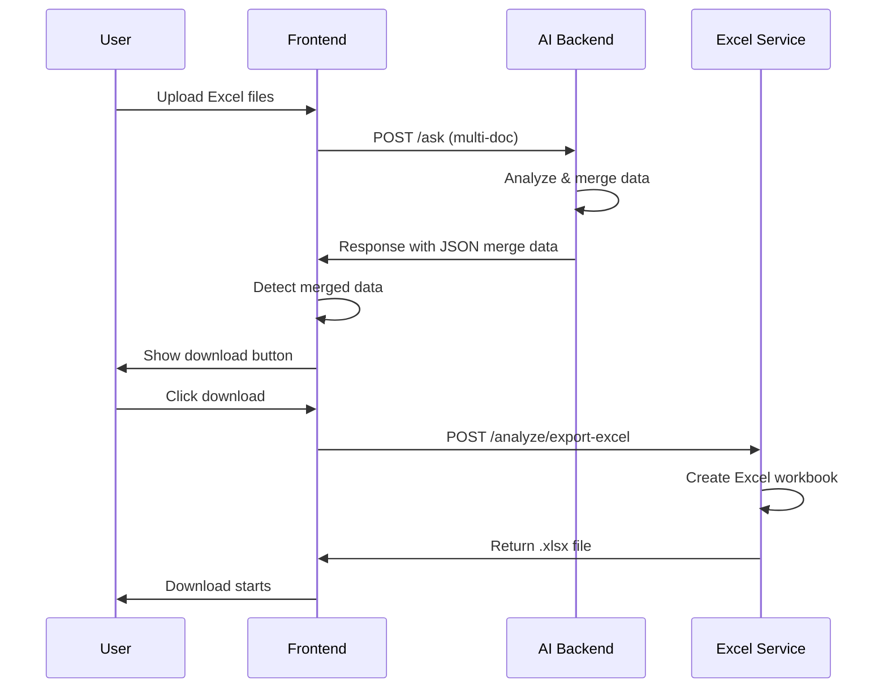

# 📊 Excel Export Feature Documentation

## Overview

The AI Doc Analyser now supports **automatic Excel file creation and download** when working with multiple Excel/CSV files. When the AI merges, combines, or consolidates data from multiple spreadsheets, users can download the results as a fully-formatted Excel file with just one click.

## How It Works

### 1. **Upload Multiple Excel Files**
Upload 2 or more Excel/CSV files using the regular document upload interface.

### 2. **Ask for Data Merging**
Use natural language to request data merging or consolidation:
- "Merge these Excel files by user ID"
- "Combine all data from both spreadsheets"
- "Export a single Excel file with all the data"
- "Consolidate these files and create a downloadable Excel"

### 3. **AI Analyzes and Merges**
The AI will:
- Auto-detect common key fields (ID, email, username, etc.)
- Match records across files
- Consolidate data intelligently
- Handle conflicts (e.g., different values for same field)
- Return merged data in JSON format

### 4. **Download Button Appears**
When the AI response contains merged data, a **green "Download Excel File" button** automatically appears below the AI message.

### 5. **Click to Download**
Click the button to instantly download a fully-formatted Excel file (.xlsx) with:
- **Summary Sheet** - Overview of merge operation
- **Merged Data Sheet** - All consolidated records with source tracking

---

## Technical Implementation

### Backend Components

#### 1. **Excel Export Endpoint** (`/analyze/export-excel`)
```javascript
POST /analyze/export-excel
Content-Type: application/json
Authorization: Bearer <token>

Request Body:
{
  "mergedData": {
    "keyField": "user_id",
    "totalRecords": 150,
    "mergedRecords": [
      {
        "key": "U001",
        "data": {
          "name": "John Doe",
          "email": "john@example.com",
          "salary": "75000"
        },
        "sources": ["employees.xlsx", "payroll.xlsx"],
        "conflicts": []
      }
    ],
    "summary": {
      "totalUniqueKeys": 150,
      "filesProcessed": 2,
      "conflictsResolved": 5
    }
  },
  "filename": "merged-data.xlsx" // Optional
}

Response:
- Content-Type: application/vnd.openxmlformats-officedocument.spreadsheetml.sheet
- Binary Excel file download
```

**Features:**
- Creates multi-sheet Excel workbook using `xlsx` library
- Auto-sizes columns for readability
- Includes summary sheet with merge statistics
- Tracks data sources for each field
- Shows conflict resolution details

#### 2. **Updated Multi-Document Prompt**
The AI is now instructed to:
- Detect merge/combine/export requests
- Return data in JSON format within code blocks
- Use standardized merge data structure
- Explain the merge process clearly

**Example AI Response:**
```
I've merged the data from both Excel files by user_id.

**Merge Summary:**
- Key field: user_id
- Files processed: employees.xlsx, payroll.xlsx
- Total unique records: 150
- Conflicts resolved: 5

**Merged Data:**
```json
{
  "keyField": "user_id",
  "totalRecords": 150,
  "mergedRecords": [
    {
      "key": "U001",
      "data": {
        "name": "John Doe",
        "email": "john@example.com",
        "department": "Engineering",
        "salary": "75000"
      },
      "sources": ["employees.xlsx", "payroll.xlsx"],
      "conflicts": []
    }
  ],
  "summary": {
    "totalUniqueKeys": 150,
    "filesProcessed": 2,
    "conflictsResolved": 5
  }
}
```

[Download Excel File Button Appears Here]
```

### Frontend Components

#### 1. **Excel Service** (`excelService.js`)
Handles Excel download logic:

```javascript
import { hasMergedData, downloadExcelFromResponse } from '../services/excelService';

// Check if AI response contains merged data
const hasExcelData = hasMergedData(aiResponse);

// Download Excel file from response
await downloadExcelFromResponse(aiResponse);
```

**Key Functions:**
- `hasMergedData(text)` - Detects if response contains downloadable data
- `extractMergedDataFromResponse(text)` - Extracts JSON from AI response
- `downloadMergedExcel(data, filename)` - Calls backend and downloads file
- `downloadExcelFromResponse(text)` - Complete flow from text to download

#### 2. **ChatMessages Component Update**
Automatically shows download button for merged data:

```jsx
// Detect merged data in AI messages
const showExcelDownload = !isUser && !isError && hasMergedData(message.content);

// Download button
{showExcelDownload && (
  <button onClick={handleDownloadExcel}>
    📥 Download Excel File
  </button>
)}
```

**Features:**
- Green download button with loading state
- Hover effects for better UX
- Error handling with user-friendly alerts
- Success confirmation after download

---

## Excel File Structure

### Sheet 1: Summary
| Field | Value |
|-------|-------|
| Merge Summary | |
| Key Field | user_id |
| Total Files Processed | 2 |
| Total Unique Keys | 150 |
| Total Records | 150 |
| Conflicts Resolved | 5 |
| Export Date | 2025-11-11T10:30:00.000Z |

### Sheet 2: Merged Data
| user_id | name | email | department | salary | Sources | Conflicts |
|---------|------|-------|------------|--------|---------|-----------|
| U001 | John Doe | john@example.com | Engineering | 75000 | employees.xlsx, payroll.xlsx | |
| U002 | Jane Smith | jane@example.com | Marketing | 68000 | employees.xlsx, payroll.xlsx | salary: 68000 vs 70000 |

**Column Descriptions:**
- **Key Column** - The common identifier (e.g., user_id, email)
- **Data Columns** - All fields from all source files
- **Sources** - Which files contained data for this record
- **Conflicts** - Fields where different values were found

---

## Use Cases

### 1. **Employee Data Consolidation**
```
Scenario:
- employees.xlsx (Name, Department, Start Date)
- payroll.xlsx (Name, Salary, Deductions)
- benefits.xlsx (Name, Health Plan, 401k)

Question: "Merge all employee data by name and create an Excel file"

Result:
- Single Excel file with all fields combined
- Source tracking for each data point
- Conflict resolution for mismatches
```

### 2. **Customer Data Aggregation**
```
Scenario:
- customers_2023.csv (Customer ID, Name, Email)
- orders_2023.csv (Customer ID, Total Orders, Revenue)
- feedback_2023.csv (Customer ID, Satisfaction Score)

Question: "Combine all customer data by customer ID and export to Excel"

Result:
- Comprehensive customer profiles
- Order history merged with feedback
- Ready for business analysis
```

### 3. **Product Inventory Sync**
```
Scenario:
- warehouse_a.xlsx (SKU, Quantity, Location)
- warehouse_b.xlsx (SKU, Quantity, Location)
- prices.xlsx (SKU, Unit Price, Discount)

Question: "Merge inventory from both warehouses and add pricing info"

Result:
- Unified inventory view
- Location tracking for each SKU
- Price data integrated
```

---

## API Workflow



---

## Error Handling

### Common Errors & Solutions

#### 1. **No Merged Data Found**
```
Error: "No merged data found in response"
Solution: Ask AI to explicitly merge/combine the data with JSON output
Example: "Merge these Excel files and provide the data in JSON format"
```

#### 2. **Invalid Merged Data Structure**
```
Error: "mergedRecords is required"
Solution: Ensure AI response contains proper JSON structure with mergedRecords array
```

#### 3. **Download Failed**
```
Error: "Failed to download Excel file"
Solution: Check:
- Authentication token is valid
- Backend server is running
- Network connection is stable
```

#### 4. **Empty Merged Records**
```
Error: "No records to export"
Solution: Ensure files have compatible data and common key fields
```

---

## Best Practices

### For Users

1. **Use Clear Merge Instructions**
   - ✅ "Merge by user_id"
   - ✅ "Combine all data from both files"
   - ❌ "Do something with these"

2. **Specify Key Field When Possible**
   - ✅ "Merge by email address"
   - ⚠️ "Merge these" (AI will auto-detect)

3. **Request Conflict Resolution**
   - ✅ "Merge and keep the latest value for conflicts"
   - ✅ "Merge and flag any discrepancies"

4. **Verify Common Fields**
   - Ensure files have at least one common field (ID, email, name, etc.)
   - Check for consistent naming (e.g., "user_id" vs "userId")

### For Developers

1. **Validate Merged Data**
   ```javascript
   if (!mergedData || !mergedData.mergedRecords) {
     throw new Error('Invalid merge data structure');
   }
   ```

2. **Handle Large Datasets**
   - Excel service auto-sizes columns (max 50 chars width)
   - Consider pagination for 10,000+ records
   - Use compression in xlsx.write()

3. **Error Logging**
   ```javascript
   console.log('📊 Exporting Excel:', {
     records: mergedData.mergedRecords.length,
     keyField: mergedData.keyField,
     sources: mergedData.summary?.filesProcessed
   });
   ```

4. **Response Headers**
   - Set correct Content-Type for Excel files
   - Include Content-Disposition for download
   - Set Content-Length for progress tracking

---

## Performance Considerations

### Backend
- **Memory Usage**: ~10MB per 10,000 records
- **Processing Time**: ~500ms per 10,000 records
- **File Size**: ~1MB per 10,000 rows (compressed)

### Frontend
- **Download Speed**: Depends on file size and network
- **Browser Compatibility**: Works in all modern browsers
- **Mobile Support**: Full support for download on mobile devices

---

## Security

### Authentication
- All Excel export endpoints require JWT authentication
- API key authentication also supported
- Rate limiting applied (100 requests/15min)

### Data Privacy
- Excel files are generated on-demand (not stored)
- No file persistence on server
- User data never leaves the session

### Input Validation
- Validates merged data structure
- Sanitizes field names and values
- Limits file size (50MB max per file)

---

## Future Enhancements

### Planned Features
1. **Advanced Formatting**
   - Cell styling (bold headers, colored cells)
   - Conditional formatting for conflicts
   - Freeze panes for better navigation

2. **Custom Templates**
   - Predefined Excel templates
   - Company branding support
   - Custom sheet layouts

3. **Batch Export**
   - Export multiple merge operations at once
   - Zip file download for large batches

4. **Data Validation**
   - Excel data validation rules
   - Dropdown lists for categories
   - Formula support

5. **Chart Generation**
   - Auto-generate charts from merged data
   - Pivot tables for analysis
   - Summary statistics

---

## Troubleshooting

### Debug Mode
Enable detailed logging:
```javascript
// Frontend
localStorage.setItem('DEBUG_EXCEL', 'true');

// Check console for:
console.log('📊 Merged data detected:', mergedData);
console.log('📥 Downloading Excel...');
console.log('✅ Download complete');
```

### Network Inspection
Check browser DevTools Network tab:
- Look for `/analyze/export-excel` request
- Verify response type is `application/vnd.openxmlformats-officedocument.spreadsheetml.sheet`
- Check response size matches expected file size

### Backend Logs
Monitor server console:
```
📊 ===== EXCEL EXPORT REQUEST =====
📄 Records to export: 150
✅ Excel file created: merged-data-1699123456789.xlsx (245687 bytes)
```

---

## Summary

The Excel export feature provides:

✅ **Automatic Detection** - AI recognizes merge requests  
✅ **One-Click Download** - Green button appears automatically  
✅ **Professional Format** - Multi-sheet Excel with summary  
✅ **Source Tracking** - Know where each data point came from  
✅ **Conflict Resolution** - Clear indication of discrepancies  
✅ **No Configuration** - Works out of the box  
✅ **Secure** - Authentication required, no file storage  
✅ **Fast** - Generates files in milliseconds  

**Just ask the AI to merge your Excel files, and download the result!** 🚀
